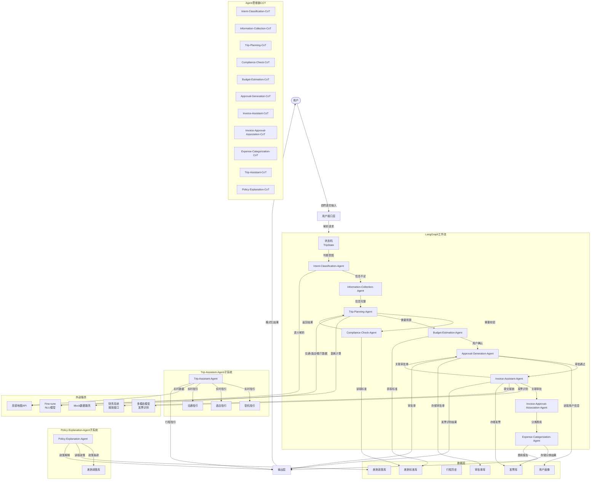

# 智能商旅助手技术设计文档

Feature Name: multi-agent-business-travel-assistant
Updated: 2026-03-20

## Description

多Agent协作智能商旅助手是一款基于LangGraph工作流框架的AI应用，通过多个具备独立思维链（Chain of Thought）的专业Agent协作，实现对用户自然语言输入的深度语义理解。系统支持出差信息收集与追问、交通住宿宴请推荐（含超标处理）、一键审批单生成等完整商旅流程。

核心特点：
- 多Agent协作：11个专业Agent通过LangGraph状态机协调工作
- 独立思维链：每个Agent通过COT逐步推理，确保理解深度
- 领域定制NLU：基于Fine-tune模型的商旅语义理解
- 智能合规检查：基于高德地图的距离计算辅助决策
- 多模态发票识别：基于多模态模型的发票/PDF自动识别与报销关联
- 实时行程助手：行程中的登机指引、交通指引等实时帮助
- 智能费用分析：自动分类发票并生成费用分析报告

## Architecture



## Components and Interfaces

### 1. LangGraph工作流引擎 (TripWorkflow)

**职责**：管理多Agent协作的状态流转，执行工作流调度

**接口**：
```python
class TripWorkflow:
    async def run(self, user_input: str, user_id: str) -> WorkflowResult
    async def get_state(self) -> TripState
    async def update_state(self, updates: Dict) -> None
```

**状态定义 (TripState)**：
```python
@dataclass
class TripState:
    # 用户信息
    user_id: str
    user_level: str  # 初级/中级/高级
    
    # 行程信息
    origin: str  # 出发地
    destination: str  # 目的地
    departure_time: Optional[datetime]
    return_time: Optional[datetime]
    travel_mode: Optional[str]  # 飞机/火车/自驾
    
    # 住宿信息
    hotel_type: Optional[str]  # 经济型/舒适型/高档/豪华
    hotel_requirement: Optional[str]
    
    # 宴请信息
    has_banquet: bool
    banquet_time: Optional[datetime]
    banquet_location: Optional[str]
    banquet_diet: Optional[str]  # 饮食要求
    banquet_budget: Optional[float]
    
    # 追问状态
    missing_fields: List[str]  # 缺失字段列表
    pending_questions: List[Question]  # 待追问问题
    
    # 推荐结果
    transport_options: List[TransportOption]
    hotel_options: List[HotelOption]
    restaurant_options: List[RestaurantOption]
    
    # Agent推理历史
    agent_reasoning: Dict[str, List[str]]  # agent_name -> reasoning_steps
    
    # 最终选择
    selected_transport: Optional[TransportOption]
    selected_hotel: Optional[HotelOption]
    selected_restaurant: Optional[RestaurantOption]
    
    # 审批单
    approval_form: Optional[ApprovalForm]
```

### 2. Intent-Classification-Agent

**职责**：判断用户输入的意图（初次出差需求 / 追问回答 / 修改选择 / 确认提交）

**思维链 (CoT)**：
```
Step 1: 接收用户自然语言输入
Step 2: 提取输入中的显式实体（地点、时间、动作词等）
Step 3: 判断输入是否包含完整的出差需求要素
Step 4: 如果要素不全，识别缺失的要素类型
Step 5: 生成结构化意图分类结果
```

**接口**：
```python
class IntentClassificationAgent:
    async def classify(self, user_input: str, current_state: TripState) -> IntentResult
    
@dataclass
class IntentResult:
    intent_type: IntentType  # INITIAL_REQUEST / INFO_PROVIDED / MODIFY_SELECTION / CONFIRM
    extracted_entities: Dict[str, Any]  # 提取的实体
    confidence: float  # 置信度
    reasoning: List[str]  # 推理步骤
```

**意图类型枚举**：
```python
enum IntentType:
    INITIAL_REQUEST  # 初次需求（如"我要去A出差"）
    INFO_PROVIDED    # 信息提供（回答追问）
    MODIFY_SELECTION # 修改选择
    CONFIRM          # 确认提交
    UNKNOWN          # 无法识别
```

### 3. Information-Collection-Agent

**职责**：识别缺失信息并生成追问话术

**思维链 (CoT)**：
```
Step 1: 接收当前TripState和提取的实体
Step 2: 对比必填字段列表与已有字段
Step 3: 识别所有缺失的必填字段
Step 4: 针对每个缺失字段，设计合适的追问话术
Step 5: 考虑追问顺序的逻辑性（如先问职级，再问目的）
Step 6: 生成最终追问问题列表
```

**追问字段及话术模板**：
| 字段 | 追问话术 | 选项 |
|------|---------|------|
| user_level | 请问您的职级是？ | 初级/基层员工、中级/中层管理者、高级/高层管理者 |
| trip_purpose | 请问此次出差的主要目的是？ | 客户拜访、项目实施、商务谈判、技术支持、内部会议 |
| customer_location | 请问客户的具体地址是？ | （用户输入） |
| travel_mode | 请问您倾向于哪种出行方式？ | 飞机、火车/高铁、自驾、其他 |
| departure_time | 请问您计划什么时候出发？ | （用户输入） |
| return_time | 请问您计划什么时候返回？ | （用户输入） |
| hotel_type | 请问您需要什么类型的住宿？ | 经济型、舒适型、高档/豪华型 |
| hotel_requirement | 请问您对酒店有什么特殊要求？ | （用户输入） |
| has_banquet | 此次出差是否涉及宴请客户？ | 是、否 |
| banquet_time | 请问宴请计划在什么时候？ | （用户输入） |
| banquet_location | 请问宴请地点在哪里？ | （用户输入） |
| banquet_diet | 请问客户有什么饮食要求吗？ | （用户输入） |
| banquet_budget | 请问您计划宴请花费多少金额？ | （用户输入） |

**接口**：
```python
class InformationCollectionAgent:
    async def identify_missing_fields(self, state: TripState) -> List[str]
    async def generate_questions(self, missing_fields: List[str]) -> List[Question]
    async def update_state(self, answers: Dict[str, Any], current_state: TripState) -> TripState
    
@dataclass
class Question:
    field: str
    question_text: str
    options: Optional[List[str]]  # 如果有预设选项
    allow_custom: bool  # 是否允许用户自定义输入
    reasoning: List[str]  # 推理步骤
```

### 4. Trip-Planning-Agent

**职责**：基于完整信息生成交通、住宿、宴请推荐

**思维链 (CoT)**：
```
Step 1: 接收完整的TripState
Step 2: 调用Compliance-Check-Agent获取差旅标准
Step 3: 基于出行时间和偏好，调用MockData获取交通选项
Step 4: 调用高德地图API计算各地点间距离
Step 5: 基于住宿要求，调用MockData获取酒店选项
Step 6: 基于宴请需求（如有），调用MockData获取餐厅选项
Step 7: 对每个选项进行合规标注
Step 8: 生成推荐结果和超标提示
```

**接口**：
```python
class TripPlanningAgent:
    async def plan_transport(self, state: TripState) -> List[TransportOption]
    async def plan_hotel(self, state: TripState) -> List[HotelOption]
    async def plan_restaurant(self, state: TripState) -> List[RestaurantOption]
    async def generate_recommendations(self, state: TripState) -> Recommendations
    
@dataclass
class TransportOption:
    type: str  # 飞机/火车
    provider: str  # 航空公司/铁路局
    flight_no: Optional[str]  # 航班/车次
    departure_time: datetime
    arrival_time: datetime
    departure_station: str
    arrival_station: str
    price: float
    is_compliant: bool
    exceeds_amount: float  # 超标金额，0表示不超标
    reasoning: List[str]  # 推荐理由
    
@dataclass
class HotelOption:
    name: str
    type: str  # 经济型/舒适型/高档/豪华型
    address: str
    distance_to_customer: float  # 距客户位置公里数
    price_per_night: float
    total_price: float
    is_compliant: bool
    exceeds_amount: float
    transportation: str  # 交通方案描述
    reasoning: List[str]
    
@dataclass
class RestaurantOption:
    name: str
    address: str
    cuisine_type: str
    distance_to_location: float
    avg_price_per_person: float
    max_budget: float
    is_compliant: bool
    exceeds_amount: float
    recommended_dishes: List[Dish]
    total_estimated_cost: float
    reasoning: List[str]
    
@dataclass
class Dish:
    name: str
    category: str  # 主菜/配菜/酒水
    price: float
    suitable_for: List[str]  # 饮食要求匹配
    
@dataclass
class Recommendations:
    transport: List[TransportOption]
    hotel: List[HotelOption]
    restaurant: List[RestaurantOption]
    warnings: List[str]  # 超标警告等信息
```

### 5. Compliance-Check-Agent

**职责**：依据公司差旅标准进行合规校验

**思维链 (CoT)**：
```
Step 1: 接收用户职级和待检查项目
Step 2: 从差旅标准库加载对应职级的标准
Step 3: 对比待检查项目的费用与标准上限
Step 4: 计算超标金额（如有）
Step 5: 生成合规检查结果
```

**差旅标准配置结构**：
```python
@dataclass
class TravelStandard:
    user_level: str
    
    # 交通标准
    flight_max_price: float  # 机票上限
    train_max_price: float   # 火车票上限
    
    # 住宿标准（每晚）
    hotel_economy_max: float   # 经济型上限
    hotel_comfort_max: float   # 舒适型上限
    hotel_luxury_max: float    # 高档/豪华型上限
    
    # 宴请标准（人均）
    banquet_max_per_person: float
    
    # 其他
    meal_allowance: float  # 餐补
    taxi_allowance: float   # 打车补贴

TRAVEL_STANDARDS = {
    "初级/基层员工": TravelStandard(
        flight_max_price=1000,
        train_max_price=500,
        hotel_economy_max=200,
        hotel_comfort_max=300,
        hotel_luxury_max=500,
        banquet_max_per_person=150,
    ),
    "中级/中层管理者": TravelStandard(
        flight_max_price=1500,
        train_max_price=800,
        hotel_economy_max=300,
        hotel_comfort_max=500,
        hotel_luxury_max=800,
        banquet_max_per_person=300,
    ),
    "高级/高层管理者": TravelStandard(
        flight_max_price=3000,
        train_max_price=1500,
        hotel_economy_max=500,
        hotel_comfort_max=800,
        hotel_luxury_max=1500,
        banquet_max_per_person=500,
    ),
}
```

**接口**：
```python
class ComplianceCheckAgent:
    async def check_transport(self, transport: TransportOption, user_level: str) -> ComplianceResult
    async def check_hotel(self, hotel: HotelOption, user_level: str) -> ComplianceResult
    async def check_banquet(self, banquet_budget: float, user_level: str) -> ComplianceResult
    async def get_standard(self, user_level: str) -> TravelStandard
    
@dataclass
class ComplianceResult:
    is_compliant: bool
    standard_limit: float
    actual_amount: float
    exceeds_amount: float
    reasoning: List[str]
```

### 6. Approval-Generation-Agent

**职责**：基于用户最终选择生成审批单

**思维链 (CoT)**：
```
Step 1: 接收用户确认的所有选择
Step 2: 汇总各项费用并计算总金额
Step 3: 识别所有超标项目
Step 4: 按审批单模板填充内容
Step 5: 生成结构化审批单
```

**审批单结构**：
```python
@dataclass
class ApprovalForm:
    form_id: str
    applicant_name: str
    applicant_level: str
    trip_purpose: str
    
    # 行程信息
    origin: str
    destination: str
    departure_time: datetime
    return_time: datetime
    
    # 交通
    selected_transport: TransportOption
    transport_total: float
    
    # 住宿
    selected_hotel: HotelOption
    hotel_nights: int
    hotel_total: float
    
    # 宴请
    has_banquet: bool
    selected_restaurant: Optional[RestaurantOption]
    banquet_estimated_cost: Optional[float]
    
    # 费用汇总
    subtotal: float
    total_exceeds: float  # 总超标金额
    items_exceeding_standard: List[str]  # 超标项目列表
    
    # 生成信息
    generated_at: datetime
    approval_url: Optional[str]  # 审批链接
```

**接口**：
```python
class ApprovalGenerationAgent:
    async def generate_approval_form(
        self, 
        state: TripState,
        selected_transport: TransportOption,
        selected_hotel: HotelOption,
        selected_restaurant: Optional[RestaurantOption]
    ) -> ApprovalForm
    
    async def export_form(
        self, 
        form: ApprovalForm, 
        format: str  # text/json/pdf
    ) -> str
```

### 7. Invoice-Assistant-Agent (多模态发票助手)

**职责**：通过多模态模型识别发票图片或PDF文件，提取结构化信息并关联至审批单

**支持的文件类型**：
- 发票图片：PNG、JPG、JPEG
- PDF文档

**支持的发票类型**：
- 增值税专用发票
- 增值税普通发票
- 火车票
- 飞机票
- 酒店发票
- 餐饮发票
- 出租车发票
- 通用机打发票

**思维链 (CoT)**：
```
Step 1: 接收用户上传的文件（图片或PDF）
Step 2: 判断文件格式并进行预处理（图片缩放、PDF转图片等）
Step 3: 调用多模态模型进行内容识别：
   - 识别文档类型（增值税发票、火车票、飞机票等）
   - 提取关键字段（发票代码、发票号码、开票日期、金额、购买方、销售方、商品明细等）
   - 识别文字内容并进行OCR校正
Step 4: 校验提取信息的完整性和格式正确性
Step 5: 生成结构化发票信息
Step 6: 检查是否存在可关联的审批单（如存在行程时间范围匹配）
Step 7: 返回识别结果及关联建议
```

**接口**：
```python
class InvoiceAssistantAgent:
    async def extract_invoice_info(
        self, 
        file_content: bytes, 
        file_type: str  # png/jpg/pdf
    ) -> InvoiceExtractionResult
    
    async def match_to_approval(
        self, 
        invoice_info: InvoiceInfo,
        pending_approvals: List[ApprovalForm]
    ) -> MatchResult
    
    async def batch_process(
        self, 
        files: List[Tuple[bytes, str]]
    ) -> BatchInvoiceResult

@dataclass
class InvoiceInfo:
    invoice_type: str  # 发票类型
    invoice_code: Optional[str]  # 发票代码
    invoice_number: Optional[str]  # 发票号码
    issue_date: Optional[date]  # 开票日期
    amount: Optional[float]  # 金额
    tax_amount: Optional[float]  # 税额
    buyer_name: Optional[str]  # 购买方名称
    seller_name: Optional[str]  # 销售方名称
    description: Optional[str]  # 商品或服务描述
    raw_text: str  # 原始识别文本
    confidence: float  # 识别置信度
    reasoning: List[str]  # 推理步骤

@dataclass
class InvoiceExtractionResult:
    success: bool
    invoice_info: Optional[InvoiceInfo]
    error_message: Optional[str]
    requires_manual_review: bool  # 是否需要人工核对

@dataclass
class MatchResult:
    matched: bool
    matched_approval_id: Optional[str]
    confidence: float
    match_reason: str

@dataclass
class BatchInvoiceResult:
    total_count: int
    success_count: int
    failed_count: int
    results: List[InvoiceExtractionResult]
    summary: InvoiceSummary

@dataclass
class InvoiceSummary:
    total_amount: float
    total_count: int
    by_type: Dict[str, int]  # 按发票类型统计数量
```

**发票类型识别与字段提取映射**：

| 发票类型 | 必需字段 | 可选字段 |
|---------|---------|---------|
| 增值税发票 | 发票代码、发票号码、开票日期、金额、购买方、销售方 | 税额、商品明细 |
| 火车票 | 车次、出发地、目的地、日期、金额 | 座位等级、乘客姓名 |
| 飞机票 | 航班号、出发地、目的地、日期、金额 | 航空公司、舱位 |
| 酒店发票 | 酒店名称、入住日期、退房日期、金额 | 房间数、入住人 |
| 餐饮发票 | 餐厅名称、消费日期、金额 | 桌号、人数 |

### 8. Invoice-Approval-Association-Agent (发票审批关联Agent)

**职责**：负责将识别的发票信息自动关联至对应的审批单，并触发报销流程

**思维链 (CoT)**：
```
Step 1: 接收发票信息列表
Step 2: 获取用户所有待处理或已完成的审批单
Step 3: 基于行程时间范围、目的地等因素进行匹配
Step 4: 生成关联建议供用户确认
Step 5: 用户确认后执行关联操作
Step 6: 检查关联后的审批单状态，如为已通过则触发报销流程
Step 7: 返回关联结果和报销状态
```

**接口**：
```python
class InvoiceApprovalAssociationAgent:
    async def associate_invoices(
        self,
        invoices: List[InvoiceInfo],
        approvals: List[ApprovalForm]
    ) -> AssociationResult
    
    async def trigger_reimbursement(
        self,
        approval_id: str
    ) -> ReimbursementResult
    
    async def get_invoice_status(
        self,
        invoice_id: str
    ) -> InvoiceStatus

@dataclass
class AssociationResult:
    associations: List[InvoiceApprovalPair]
    unmatched_invoices: List[InvoiceInfo]
    suggestions: List[AssociationSuggestion]

@dataclass
class InvoiceApprovalPair:
    invoice_id: str
    approval_id: str
    confidence: float
    user_confirmed: bool

@dataclass
class ReimbursementResult:
    success: bool
    reimbursement_id: Optional[str]
    status: str  # submitted/approved/rejected
    error_message: Optional[str]
```

### 9. Budget-Estimation-Agent (预算估算Agent)

**职责**：在规划阶段计算预估总费用，评估超标风险，并提供优化建议

**思维链 (CoT)**：
```
Step 1: 接收TripPlanning-Agent生成的推荐方案
Step 2: 汇总所有交通方案的预估费用
Step 3: 汇总所有住宿方案的预估费用
Step 4: 汇总宴请方案的预估费用（如有）
Step 5: 获取用户职级对应的差旅标准
Step 6: 计算各项费用与标准的差额
Step 7: 计算总预估费用与总标准的差额
Step 8: 生成超标风险评估（高/中/低）
Step 9: 生成优化建议（如有超标）
```

**接口**：
```python
class BudgetEstimationAgent:
    async def estimate_budget(
        self,
        transport_options: List[TransportOption],
        hotel_options: List[HotelOption],
        restaurant_options: Optional[List[RestaurantOption]],
        user_level: str
    ) -> BudgetEstimation
    
    async def calculate_savings(
        self,
        current_selection: Dict[str, Any],
        alternative_selection: Dict[str, Any]
    ) -> SavingsCalculation
    
    async def generate_optimization_suggestions(
        self,
        budget_result: BudgetEstimation
    ) -> List[OptimizationSuggestion]

@dataclass
class BudgetEstimation:
    transport_total: float
    hotel_total: float
    banquet_total: float
    grand_total: float
    
    transport_standard: float
    hotel_standard: float
    banquet_standard: float
    total_standard: float
    
    exceeds_amount: float
    exceeds_items: List[str]
    
    risk_level: str  # HIGH/MEDIUM/LOW
    
    reasoning: List[str]

@dataclass
class SavingsCalculation:
    category: str
    current_amount: float
    alternative_amount: float
    savings: float
    savings_percentage: float

@dataclass
class OptimizationSuggestion:
    category: str
    current_choice: str
    suggested_choice: str
    current_price: float
    suggested_price: float
    savings: float
    reasoning: str
```

### 10. Policy-Explanation-Agent (政策解读Agent)

**职责**：解释差旅政策的具体规定，帮助用户理解超标原因和合规要求

**思维链 (CoT)**：
```
Step 1: 接收用户的政策解释请求（可包含超标项目描述）
Step 2: 获取用户职级对应的差旅标准详细条款
Step 3: 解析超标项目的具体情况（超标金额、原因等）
Step 4: 检索相关的差旅政策条款原文
Step 5: 生成易于理解的语言解释
Step 6: 提供合规范围内的替代方案建议
```

**接口**：
```python
class PolicyExplanationAgent:
    async def explain_overstandard_item(
        self,
        item_type: str,  # transport/hotel/banquet
        actual_amount: float,
        user_level: str
    ) -> PolicyExplanation
    
    async def explain_standard_item(
        self,
        item_type: str
    ) -> StandardExplanation
    
    async def get_policy_clause(
        self,
        clause_id: str
    ) -> PolicyClause

@dataclass
class PolicyExplanation:
    item_type: str
    user_level: str
    
    standard_limit: float
    actual_amount: float
    exceeds_amount: float
    
    policy_clauses: List[PolicyClause]
    
    alternative_suggestions: List[str]
    
    explanation_text: str
    reasoning: List[str]

@dataclass
class PolicyClause:
    clause_id: str
    title: str
    content: str
    source: str  # 政策文件来源
    effective_date: date

@dataclass
class StandardExplanation:
    item_type: str
    description: str
    standard_limits: Dict[str, float]
    claim_process: str
    required_documents: List[str]
```

### 11. Trip-Assistant-Agent (行程助手Agent)

**职责**：在行程中提供实时帮助，包括登机指引、交通指引、酒店入住帮助等

**思维链 (CoT)**：
```
Step 1: 接收用户的位置或帮助请求
Step 2: 解析用户当前位置（如有）
Step 3: 关联用户的行程计划（航班、酒店等）
Step 4: 识别用户可能需要的信息类型
Step 5: 调用高德地图API获取相关地点信息
Step 6: 计算路线、距离、预估时间
Step 7: 生成详细的帮助指引
```

**接口**：
```python
class TripAssistantAgent:
    async def get_boarding_guidance(
        self,
        user_id: str,
        flight_info: FlightInfo,
        current_time: datetime
    ) -> BoardingGuidance
    
    async def get_hotel_guidance(
        self,
        user_id: str,
        hotel_info: HotelInfo,
        arrival_location: str,
        arrival_time: datetime
    ) -> HotelGuidance
    
    async def get_local_transport(
        self,
        from_location: str,
        to_location: str,
        preference: Optional[str]  # taxi/metro/bus
    ) -> TransportGuidance
    
    async def check_flight_updates(
        self,
        flight_no: str,
        date: date
    ) -> FlightUpdate
    
    async def send_proactive_reminder(
        self,
        user_id: str,
        reminder_type: str
    ) -> ReminderResult

@dataclass
class BoardingGuidance:
    flight_no: str
    departure_airport: str
    arrival_airport: str
    departure_time: datetime
    gate: str
    gate_location: str  # 登机口在航站楼的具体位置
    distance_from_entrance: float  # 从入口到登机口的距离（米）
    walking_time: int  # 预计步行时间（分钟）
    current_gate: Optional[str]  # 如果登机口有变更
    boarding_time: datetime
    reasoning: List[str]

@dataclass
class HotelGuidance:
    hotel_name: str
    hotel_address: str
    hotel_phone: str
    check_in_time: str
    check_out_time: str
    
    from_location: str
    transport_options: List[TransportOption]
    recommended_option: TransportOption
    estimated_travel_time: int  # 分钟
    reasoning: List[str]

@dataclass
class TransportOption:
    transport_type: str  # taxi/metro/bus/walk
    route_description: str
    distance: float  # 公里
    estimated_time: int  # 分钟
    estimated_cost: float
    instructions: List[str]  # 详细指引步骤

@dataclass
class FlightUpdate:
    flight_no: str
    date: date
    status: str  # on_time/delayed/cancelled
    gate_change: Optional[str]
    new_departure_time: Optional[datetime]
    delay_duration: Optional[int]  # 分钟
```

### 12. Expense-Categorization-Agent (费用分类Agent)

**职责**：将发票按类型分类，计算费用结构，生成费用分析报告

**思维链 (CoT)**：
```
Step 1: 接收发票列表（由Invoice-Assistant-Agent识别）
Step 2: 对每张发票进行类型分类（交通、住宿、餐饮、其他）
Step 3: 提取发票金额并汇总
Step 4: 按审批单或时间范围聚合发票
Step 5: 计算各类别费用的占比
Step 6: 与差旅标准进行对比分析
Step 7: 识别异常费用项（如超出常规的大额支出）
Step 8: 生成结构化的费用分析报告
```

**接口**：
```python
class ExpenseCategorizationAgent:
    async def categorize_expenses(
        self,
        invoices: List[InvoiceInfo],
        approval_id: Optional[str] = None,
        date_range: Optional[Tuple[date, date]] = None
    ) -> ExpenseCategorizationResult
    
    async def generate_expense_report(
        self,
        categorization_result: ExpenseCategorizationResult,
        user_level: str,
        format: str  # excel/pdf
    ) -> ExpenseReport
    
    async def detect_anomalies(
        self,
        categorized_expenses: ExpenseCategorizationResult
    ) -> List[ExpenseAnomaly]

@dataclass
class ExpenseCategorizationResult:
    total_amount: float
    category_summary: Dict[str, CategorySummary]
    expense_items: List[CategorizedExpense]
    anomalies: List[ExpenseAnomaly]
    
    @dataclass
    class CategorySummary:
        category: str  # transport/hotel/banquet/other
        total_amount: float
        count: int
        percentage: float
        exceeds_standard: bool
        exceeds_amount: float
    
    @dataclass
    class CategorizedExpense:
        invoice_id: str
        category: str
        amount: float
        description: str
        date: date
        approval_id: Optional[str]

@dataclass
class ExpenseAnomaly:
    invoice_id: str
    category: str
    amount: float
    anomaly_type: str  # LARGE_AMOUNT/UNUSUAL_CATEGORY/OVERSIZED
    description: str
    severity: str  # HIGH/MEDIUM/LOW

@dataclass
class ExpenseReport:
    report_id: str
    generated_at: datetime
    
    # 基本信息
    user_id: str
    user_level: str
    period: str  # 报表周期
    
    # 费用汇总
    total_amount: float
    category_breakdown: Dict[str, float]
    category_percentages: Dict[str, float]
    
    # 合规分析
    standard_compliance: Dict[str, bool]
    exceeds_items: List[str]
    exceeds_total: float
    
    # 异常费用
    anomalies: List[ExpenseAnomaly]
    
    # 明细
    expense_details: List[CategorizedExpense]
    
    # 汇总表格
    summary_table: List[Dict]
```

## Data Models

### 核心数据模型

```python
# 用户画像
@dataclass
class UserProfile:
    user_id: str
    name: str
    level: str
    department: str
    travel_history: List[str]  # 行程ID列表
    
# 行程记录
@dataclass
class TripRecord:
    trip_id: str
    user_id: str
    state: TripState
    approval_form: ApprovalForm
    status: str  # pending/approved/rejected/completed
    created_at: datetime
    updated_at: datetime

# 发票记录
@dataclass
class InvoiceRecord:
    invoice_id: str
    user_id: str
    invoice_info: InvoiceInfo
    approval_id: Optional[str]  # 关联的审批单ID
    status: str  # pending/associated/submitted/reimbursed/rejected
    uploaded_at: datetime
    processed_at: Optional[datetime]
    reimbursement_id: Optional[str]  # 报销单ID

# 报销记录
@dataclass
class ReimbursementRecord:
    reimbursement_id: str
    approval_id: str
    invoice_ids: List[str]
    total_amount: float
    status: str  # submitted/approved/rejected/paid
    submitted_at: datetime
    approved_at: Optional[datetime]
    paid_at: Optional[datetime]
```

### Mock数据结构

```python
# Mock交通数据
MOCK_TRANSPORT_DATA = {
    "flights": [
        {
            "flight_no": "CA1234",
            "airline": "中国国航",
            "origin": "北京",
            "destination": "上海",
            "departure_time": "2026-03-21 08:00",
            "arrival_time": "2026-03-21 10:30",
            "price": 680,  # 经济舱
            "available": True
        },
        # ...更多航班
    ],
    "trains": [
        {
            "train_no": "G1234",
            "type": "高铁",
            "origin": "北京",
            "destination": "上海",
            "departure_time": "2026-03-21 09:00",
            "arrival_time": "2026-03-21 13:00",
            "price": 553,
            "available": True
        },
        # ...更多车次
    ]
}

# Mock酒店数据
MOCK_HOTEL_DATA = {
    "location_hotels": {
        "上海-浦东新区": [
            {
                "name": "上海外滩豪华酒店",
                "type": "高档/豪华型",
                "address": "上海浦东新区外滩路100号",
                "star_rating": 5,
                "price_per_night": 1200,
                "distance_to_center": 2.5,
                "amenities": ["WiFi", "停车场", "健身房"]
            },
            # ...更多酒店
        ]
    }
}

# Mock餐厅数据
MOCK_RESTAURANT_DATA = {
    "restaurants": [
        {
            "name": "老上海本帮菜",
            "cuisine_type": "本帮菜",
            "address": "上海浦东新区南京东路200号",
            "distance_to_center": 1.5,
            "price_range": "150-300/人",
            "suitable_for": ["商务宴请", "朋友聚餐"],
            "diet_options": ["清真", "素食"]
        },
        # ...更多餐厅
    ]
}
```

## Correctness Properties

### 状态机流转正确性

1. **单一起点和终点**：状态机必须从`INITIAL`状态开始，最终到达`APPROVAL_GENERATED`或`END`状态
2. **有效转换**：每个状态只能转换到预定义的下一个状态
3. **状态不回退**：`missing_fields`为空后，不应再回到`COLLECTING`状态
4. **完整性检查**：进入`PLANNING`状态时，`TripState`必须包含所有必填字段

### Agent推理正确性

1. **意图分类唯一性**：同一输入只能被分类为一个意图类型
2. **字段识别完整性**：当`missing_fields`非空时，必须为每个缺失字段生成追问
3. **合规检查一致性**：相同职级和金额的检查结果必须一致

### 数据一致性

1. **金额计算正确性**：总费用 = 交通费 + 住宿费 + 宴请费，误差不超过0.01
2. **距离计算准确性**：高德地图API返回的距离与推荐交通方案匹配

## Error Handling

### 异常场景处理

| 场景 | 处理策略 |
|------|---------|
| NLU模型无法理解输入 | 返回"抱歉，我无法理解您的意思，请重新描述" |
| 高德地图API调用失败 | 使用Mock距离数据，标注"距离数据仅供参考" |
| Mock数据为空 | 返回空列表并提示"暂无可用选项" |
| 用户拒绝回答追问 | 记录用户拒绝，提供默认选项或跳过该字段 |
| 超时未响应 | 保存当前状态，支持后续继续 |

### 错误响应格式

```python
@dataclass
class ErrorResponse:
    error_code: str
    message: str
    suggested_action: str  # 建议用户采取的行动
    recovery_data: Optional[Any]  # 用于恢复的数据
```

## Test Strategy

### 单元测试

| 测试对象 | 测试内容 |
|---------|---------|
| IntentClassificationAgent | 各种意图分类场景 |
| InformationCollectionAgent | 字段缺失识别和追问生成 |
| ComplianceCheckAgent | 各职级标准合规检查 |
| TripPlanningAgent | 推荐生成逻辑 |
| ApprovalGenerationAgent | 审批单填充正确性 |

### 集成测试

| 测试场景 | 验证点 |
|---------|-------|
| 完整初次请求流程 | 用户输入->意图分类->信息收集->行程规划 |
| 追问回答流程 | 回答->状态更新->继续追问/进入规划 |
| 超标处理流程 | 超标识别->替代方案->超标说明 |
| 审批单生成流程 | 确认选择->生成审批单->导出 |

### 端到端测试

```python
# 示例测试用例
test_case = {
    "name": "完整出差规划流程",
    "user_input_sequence": [
        "我明天从北京去上海出差",
        "我是基层员工",
        "客户在浦东新区",
        "坐高铁去",
        "明天早上8点出发，后天下午5点回来",
        "住高档酒店",
        "需要宴请，客户是穆斯林",
        "预算1000",
        "第一个高铁和第三个酒店",
        "确认提交"
    ],
    "expected_outputs": [
        {"type": "question", "field": "user_level"},
        {"type": "question", "field": "customer_location"},
        # ...
        {"type": "approval_form"}
    ]
}
```

## Implementation Plan

### Phase 1: 核心框架搭建
- [ ] 搭建LangGraph项目结构
- [ ] 实现TripState状态机定义
- [ ] 实现基础Agent接口和CoT框架

### Phase 2: NLU模块
- [ ] 定义Fine-tune模型接口
- [ ] 实现Mock NLU服务（用于开发阶段）
- [ ] 集成NLU进行语义解析

### Phase 3: Agent实现（核心流程）
- [ ] 实现Intent-Classification-Agent
- [ ] 实现Information-Collection-Agent
- [ ] 实现Compliance-Check-Agent
- [ ] 实现Trip-Planning-Agent
- [ ] 实现Approval-Generation-Agent

### Phase 4: 外部服务集成
- [ ] 实现高德地图API集成
- [ ] 实现Mock数据服务
- [ ] 实现差旅标准配置管理

### Phase 5: 发票助手模块
- [ ] 实现Invoice-Assistant-Agent多模态识别接口
- [ ] 实现Mock多模态模型服务（用于开发阶段）
- [ ] 实现发票类型识别与字段提取
- [ ] 实现Invoice-Approval-Association-Agent关联逻辑
- [ ] 实现发票批量处理功能
- [ ] 实现财务系统报销接口对接

### Phase 6: 预算与政策Agent
- [ ] 实现Budget-Estimation-Agent预算估算逻辑
- [ ] 实现Policy-Explanation-Agent政策解读逻辑
- [ ] 实现差旅政策库设计与对接
- [ ] 实现超标优化建议生成

### Phase 7: 行程助手模块
- [ ] 实现Trip-Assistant-Agent实时指引功能
- [ ] 实现登机口指引（含路线计算）
- [ ] 实现酒店入住指引
- [ ] 实现当地交通指引
- [ ] 实现航班动态更新推送
- [ ] 实现主动行程提醒

### Phase 8: 费用分析模块
- [ ] 实现Expense-Categorization-Agent分类逻辑
- [ ] 实现费用异常检测
- [ ] 实现费用报告生成（Excel/PDF）
- [ ] 实现费用结构可视化

### Phase 9: 用户交互
- [ ] 实现对话式交互界面
- [ ] 实现文件上传功能（发票图片/PDF）
- [ ] 实现审批单导出功能
- [ ] 实现用户确认和修改流程
- [ ] 实现发票报销状态查询
- [ ] 实现行程助手实时对话

### Phase 10: 测试与优化
- [ ] 单元测试编写
- [ ] 集成测试
- [ ] 端到端测试（包括发票识别流程）
- [ ] 性能优化

## References

- LangGraph Documentation: https://langchain-ai.github.io/langgraph/
- 高德地图API: https://lbs.amap.com/
